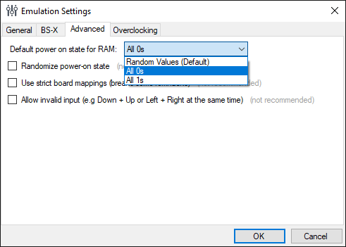

# SNES Assembly Adventure Code Examples

This repository holds the code examples from my tutorial series [SNES Assembly Adventure](https://georgjz.github.io/snesaa01/).

The code in this repository has been updated to work with both [bsnes+][bsnes+] and [Mesen-S][mesen-s] as well. Therefore, it will slightly deviate from the code examples in the articles linked above.

**Important**: For the first 8 examples to work, you need to change Mesen-S emulation settings. Set "Power on state of RAM:" to "All 0s":

Otherwise, the code examples here won't work. Starting with part 9, the settings no longer matters as proper initialization code for the SNES is added.

[bsnes+]: https://github.com/devinacker/bsnes-plus
[mesen-s]: https://github.com/SourMesen/Mesen-S
